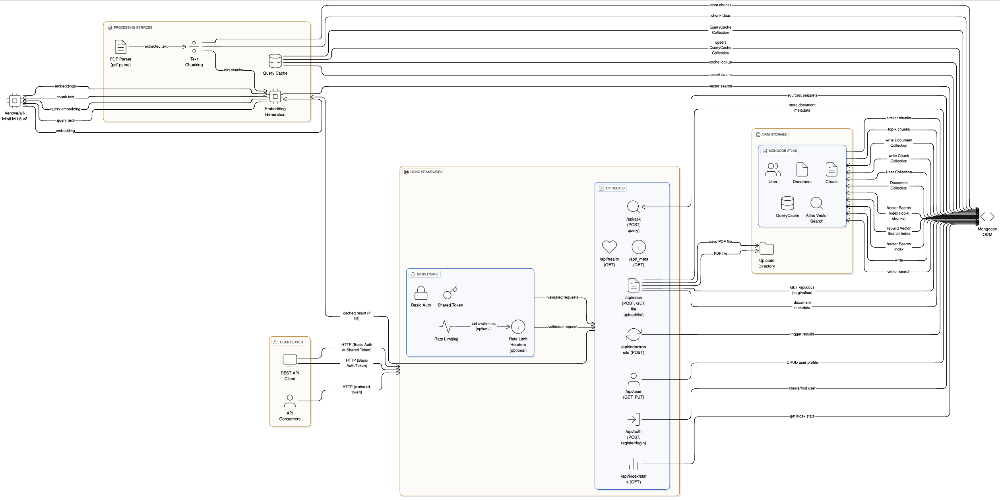

# **KnowledgeScout**

**Objective:** Upload docs, embed them, and answer queries with snippet sources and valid page references.

**_System Design_**

The system supports PDF-only document uploads, extracting text and generating embeddings using the Xenova/all-MiniLM-L6-v2 model. These embeddings and metadata are stored in MongoDB, leveraging the vector-search index for efficient similarity searches. When users submit queries, the system generates embeddings and creates a queryHash to check the cache. If a cached answer exists, it's returned immediately; otherwise, a similarity search retrieves relevant document snippets from MongoDB, and the result is cached for future use. Authentication is implemented through basic user management and shared token validation via the x-shared-token header. Rate limiting prevents abuse using an in-memory map that tracks request counts per user, with the x-rate-limit header informing users of their status. Pagination support enables efficient listing of documents and queries. The database design includes four schemas: User schema stores credentials and metadata, Document schema contains metadata and references to chunks, Chunk schema holds text snippets with embeddings and parent document references, and QueryCache schema stores query hashes with their corresponding answers for efficient caching.

[](./image.png)

---

Tech Stack: Hono, MongoDB, Mongoose, pdf-parse, Xenova/all-MiniLM-L6-v2

### Core Features:

- User Authentication & Management
- PDF Document Upload & Text Extraction
- Text Embedding Generation using Xenova/all-MiniLM-L6-v2
- Vector Search Indexing in MongoDB
- Query Handling with Similarity Search & Caching
- Rate Limiting & Pagination Support

### Setup Instructions

1. **Clone the Repository:**
   ```bash
   git clone <repository-url>
    cd knowledge-scout
   ```
2. **Install Dependencies:**

   ```bash
   pnpm install
   ```

3. **Configure Environment Variables:**
   Create a `.env` file in the root directory and refer to `.env.example` for required variables.

4. **Build the package:**

   ```bash
   pnpm build:packages
   ```

5. **Start the Application:**
   ```bash
   pnpm watch
   ```

### Authentication

Test Credentials:

- **email:** admin@mail.com
- **password:** admin@123

---

## API Documentation

### Authentication

- POST /api/auth
  Create a user account
  Body: email, password
  Returns: userId, shareToken

- GET /api/user
  Get user details
  Auth: Basic Auth

### Documents

- POST /api/docs
  Upload a PDF document
  Auth: Basic Auth
  Body: file (PDF, form-data)
  Returns: documentId

- GET /api/docs
  List all uploaded documents
  Auth: Basic Auth
  Query: limit, offset (pagination)

- GET /api/docs/:id
  Get specific document details
  Auth: Basic Auth
  Params: id (documentId)

### Query

- POST /api/ask
  Ask a question and get answers with sources
  Auth: Basic Auth
  Body: query, k (number of sources to return, default 3)
  Returns: Answers with document sources

### Index Management

- POST /api/index/rebuild
  Rebuild the vector search index
  Auth: Basic Auth

- GET /api/index/stats
  Get vector search index statistics
  Auth: Basic Auth

### Meta

- GET /api/health
  Health check endpoint

- GET /api/\_meta
  API metadata information
